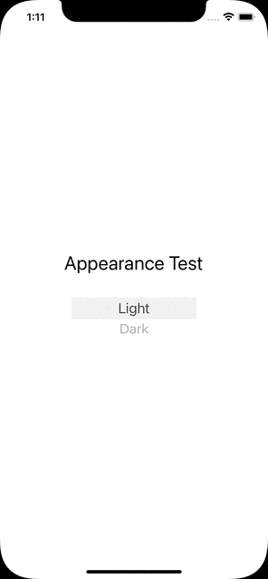

# Switch To The Dark Side in SwiftUI - 

## Systemwide light and dark mode (and automatic) for apps with the SceneDelegate lifecycle


This repo is intended to serve as a starting point for a blog post on how to implement a switch to change the appearance between light, dark and automatic in SwiftUI AppDelegate based structure.


The app support localisation and gives the user the option to change systemwide the settings for dark and light mode. These are set to userdefaults fior the next time the app is launched.



I used the hint provided in the answer by [in the answer by Mojtaba Hosseini][1] to make my own version in SwiftUI (App with the AppDelegate lifecycle). I did not look into using iOS14's @main instead of SceneDelegate yet.


I need to access the `SceneDelegate` and I use the same code as Mustapha with a small addition, when the app starts I need to read the settings stored in UserDefaults or @AppStorage etc.  
Therefore I update the UI again on launch with the `updateUserInterfaceStyle()` function:   

```swift
private(set) static var shared: SceneDelegate?

func scene(_ scene: UIScene, willConnectTo session: UISceneSession, options connectionOptions: UIScene.ConnectionOptions) {
    Self.shared = self

    // this is for when the app starts - read from the user defaults
    updateUserInterfaceStyle()
}
```

The function `updateUserInterfaceStyle()` will be in `SceneDelegate`.
I use an extension of UserDefaults here (thanks to [twanni][3]!):    

```swift
func updateUserInterfaceStyle() {
		DispatchQueue.main.async {
			switch UserDefaults.userInterfaceStyle {
			case 0:
				self.window?.overrideUserInterfaceStyle = .unspecified
			case 1:
				self.window?.overrideUserInterfaceStyle = .light
			case 2:
				self.window?.overrideUserInterfaceStyle = .dark
			default:
				self.window?.overrideUserInterfaceStyle = .unspecified
			}
		}
	}
```

This is consistent with the [apple documentation for `UIUserInterfaceStyle`][4]

Using a picker means that I need to iterate on my three cases so I made an enum which conforms to identifiable and is of type `LocalizedStringKey` for the localisation:  

```swift
// check LocalizedStringKey instead of string for localisation!
enum Appearance: LocalizedStringKey, CaseIterable, Identifiable {
	case light
	case dark
	case automatic

	var id: String { UUID().uuidString }
}
``` 

And this is the full code for the picker:  
```swift

struct AppearanceSelectionPicker: View {
	@Environment(\.colorScheme) var colorScheme
	@State private var selectedAppearance = Appearance.automatic

	var body: some View {
		HStack {
			Text("Appearance")
				.padding()
				.frame(minWidth: 0, maxWidth: .infinity, alignment: .leading)
			Picker(selection: $selectedAppearance, label: Text("Appearance"))  {
				ForEach(Appearance.allCases) { appearance in
					Text(appearance.rawValue)
						.tag(appearance)
				}
			}
			.pickerStyle(WheelPickerStyle())
			.frame(width: 150, height: 50, alignment: .center)
			.padding()
			.clipShape(RoundedRectangle(cornerRadius: 20, style: .continuous))
			.frame(minWidth: 0, maxWidth: .infinity, alignment: .leading)
		}
		.padding()

		.onChange(of: selectedAppearance, perform: { value in
			print("changed to ", value)
			switch value {
				case .automatic:
					UserDefaults.userInterfaceStyle = 0
					SceneDelegate.shared?.window?.overrideUserInterfaceStyle =  .unspecified
				case .light:
					UserDefaults.userInterfaceStyle = 1
					SceneDelegate.shared?.window?.overrideUserInterfaceStyle =  .light
				case .dark:
					UserDefaults.userInterfaceStyle = 2
					SceneDelegate.shared?.window?.overrideUserInterfaceStyle =  .dark
			}
		})
		.onAppear {
			print(colorScheme)
			print("UserDefaults.userInterfaceStyle",UserDefaults.userInterfaceStyle)
			switch UserDefaults.userInterfaceStyle {
				case 0:
					selectedAppearance = .automatic
				case 1:
					selectedAppearance = .light
				case 2:
					selectedAppearance = .dark
				default:
					selectedAppearance = .automatic
			}
		}
	}
}
```

The code `onAppear` is there to set the wheel to the correct value when the user gets to that settings view. Every time that the wheel is moved, through the `.onChange` modifier, the user defaults are updated and the app changes the settings for all views through its reference to the `SceneDelegate`. 


  [1]: https://stackoverflow.com/a/58476468/9497800
  [3]: https://www.avanderlee.com/swift/property-wrappers/
  [4]: https://developer.apple.com/documentation/uikit/uiuserinterfacestyle


### sources:  
- the original stackoverflow answer: https://stackoverflow.com/a/58476468/9497800  
- avanderlee post: https://www.avanderlee.com/swift/property-wrappers/  
- Apple docs: https://developer.apple.com/documentation/uikit/uiuserinterfacestyle  
- Apple docs for the Picker - https://developer.apple.com/documentation/swiftui/picker


